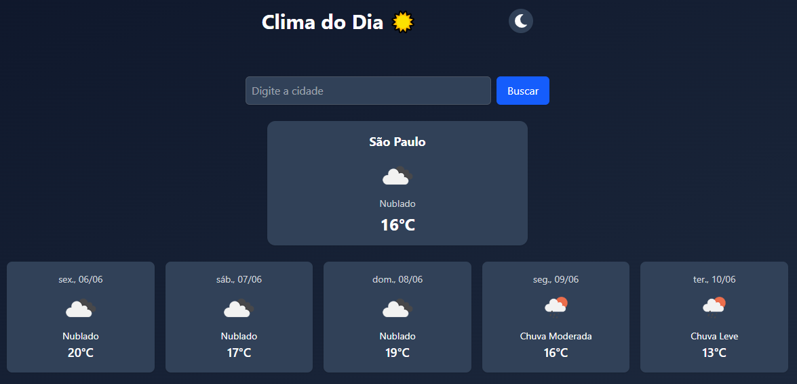

# 🌤️ Clima do Dia

Aplicativo web que permite buscar o clima atual de qualquer cidade, além da previsão para os próximos dias, com suporte a tema claro/escuro e interface responsiva.

 

## 🚀 Funcionalidades

- 🔍 Busca por nome da cidade
- 📍 Exibição do clima atual (nome da cidade, descrição, temperatura e ícone)
- 📆 Previsão para os próximos **5 dias** (1 previsão por dia às 12h)
- 🌗 Alternância entre tema **claro e escuro**
- 📱 Responsivo para celular, tablet e desktop
- ⏳ Feedback de carregamento e tratamento de erros

---

## 🛠️ Tecnologias utilizadas

- [React.js](https://reactjs.org/)
- [Tailwind CSS](https://tailwindcss.com/)
- [OpenWeatherMap API](https://openweathermap.org/api)

---

## 📦 Instalação e execução local

### Pré-requisitos

- Node.js e npm instalados
- Conta gratuita na [OpenWeatherMap](https://openweathermap.org/) para obter sua API key

### Passos

```bash
1. Clone o repositório:
git clone https://github.com/seu-usuario/clima-do-dia.git
cd clima-do-dia

2. Instale as dependências:
npm install

2. Instale as dependências:
npm install

3. Inicie o projeto em ambiente de desenvolvimento:
npm run dev

## 💡 Melhorias futuras
- Sugestões de cidades (autocomplete)
- Localização por GPS
- Sensação térmica e velocidade do vento
- Histórico de buscas recentes

